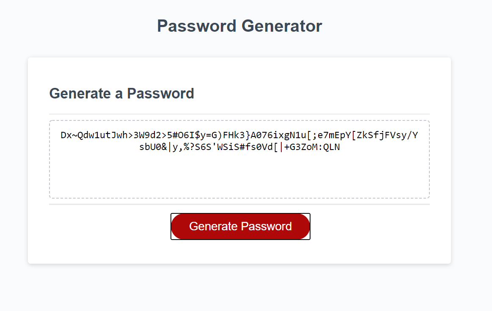

# Password-Generator
The user will set password parameters, and a password will be randomly generated!
First, the user clicks on the Generate Password button. 
Then the user be asked a series of prompts, determining the password parameters. 
The user picks the length of the password (8-128 characters)
Then the user decides whether or not to use the following:
Uppercase letters
Lowercase letters
Numbers
The following (OWASP)symbols: !"#$%&'()*+,-./:;<>=?@\][^_{|}~

In addition, if the user picks an incorrect password length, they will be notified, and the function will restart. 
If the user does not pick at least one type of character, they will also be notified, and the function will restart. 
After user inputs acceptable criteria, the password is generated to the page. 

